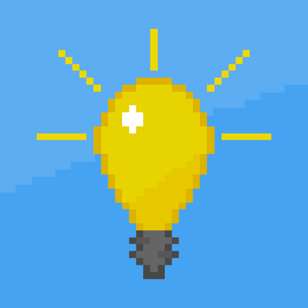

        
        <h1>{{site.data.profile.name}}</h1>
        <h1>{{site.data.profile.handle}}</h1>
        <h2>Hobbyist programmer, the sole member & founder of  Enlighten Works, second-year CS&E student at TU Delft</h2>
        

            
                
            
        

    <section>
        <header>
            <a><h2>Hello World!</h2></a>
        </header>

        <h3>I'm Evaldas, and I am a junior student developer!</h3>

        
I would describe myself as curious, highly motivated, hard working and passionate about programming.
            My main interest revolves around software & application development. However, I keep an open mind
            and am currently on the path to decide which Computer Science discipline I would like to get involved
            in the most!
        

        

            
                

                    

                        <i class="fas {{entry.icon}}"></i>
                        {{entry.name}}
                    

                    
                    
{{entry.content}}

                

            
        

         
    </section>

    <section>
        <header>
            <h2>Skills</h2>
        </header>

        

            <!-- Create Navbar from all the category data in skills -->
            
                <button class="skill-category-choice info-button" menu="{{category.name}}">{{category.name}}</button>
            
        

        <!-- Create skill menu for each category -->
        

            <!-- Create menu for each category -->
            
                

                    <!-- Create entry for each skill -->
                    
                        
                    
                

            
        

    </section>

    <section>
        <header>
            <h2>Projects</h2>
        </header>

        

            
                
            
        

    </section>

    <section>
        <header>
            <h2>Other Activity</h2>
        </header>

        

            
                

                
                    

                
            
        

    </section>

    <section>
        

            Site uses icons from:
            <a href="https://icons8.com/">Icons8</a>
            <a href="https://www.iconfinder.com/">IconFinder</a>
        

    </section>

